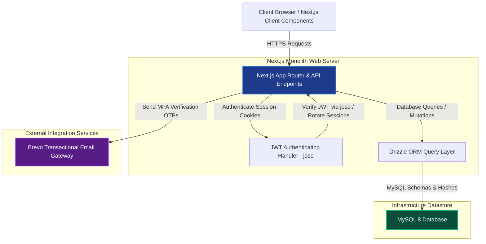
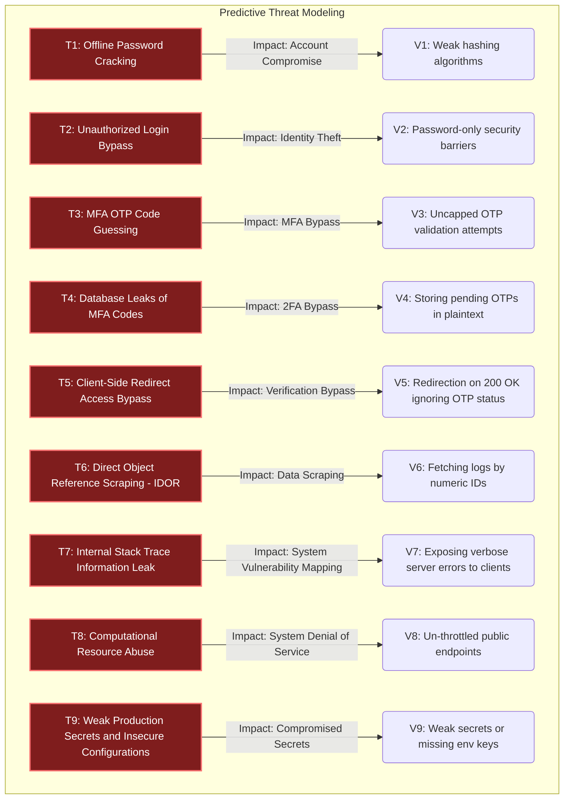

# Smart Finance Tracker - Information Assurance & Security Report
**System Security Architecture and Predictive Threat & Vulnerability Audit**

---

## 1. System Overview & Architecture

### 1.1. System Description
Smart Finance Tracker is a web application built to help users organize budget categories, log financial transactions, track active debts, monitor goals, and query an AI assistant. 

**Current Implementation Status**: 
*   **Active Subsystem**: The user authentication and security subsystem (registration, login, OTP verification, session cookies, and audit logs) is fully active, server-side verified, and backed by a MySQL database.
*   **Mock Subsystem**: The private pages (dashboard, transactions, debts, goals, and the chatbot interface) are currently high-fidelity frontend mockups that operate on local client-side state and mock data. They do not yet execute database queries or call external APIs (like Gemini) on the server.

### 1.2. Target Users
1.  **Financial Trackers (Regular Users)**: Interact with the dashboard, log transactions, track goals, manage active debts, and query the AI chatbot interface.
2.  **System Admins**: Audit log directories, manage default categories, and review system metrics.

### 1.3. System Architecture
The authentication layer is fully database-driven, while the functional dashboard components are simulated on the client side.



---

## 2. Threat & Vulnerability Identification
*(Predictive Analysis: Modeling System Threats and Vulnerabilities)*

During threat modeling, nine security vulnerabilities were mapped to evaluate system protection bounds. Active controls mitigate authentication risks, while architectural rules are defined to cover planned datastore features.



---

## 3. Security Implementation
*(Technical Audits and Implemented Controls Matrix)*

### Control 1: Bcryptjs Password Hashing
*   **Status**: **ACTIVE & FULLY IMPLEMENTED**
*   **Threat Addressed**: T1: Offline Password Cracking & Database Leak Exposure
*   **How it Works**: The backend hashes passwords asynchronously using **bcryptjs** (with salt rounds of 10) inside `src/lib/security.ts`. Unique salts are generated for every password automatically during registration.
*   **Drizzle Schema**:
```typescript
// Location: src/db/schema.ts
import { mysqlTable, varchar, timestamp } from "drizzle-orm/mysql-core";

export const users = mysqlTable("users", {
  id: varchar("id", { length: 36 }).primaryKey().$defaultFn(() => crypto.randomUUID()),
  name: varchar("name", { length: 255 }).notNull(),
  email: varchar("email", { length: 255 }).notNull(),
  passwordHash: varchar("password_hash", { length: 255 }).notNull(),
  emailVerifiedAt: timestamp("email_verified_at"),
  createdAt: timestamp("created_at").default(sql`CURRENT_TIMESTAMP`),
  updatedAt: timestamp("updated_at").default(sql`CURRENT_TIMESTAMP ON UPDATE CURRENT_TIMESTAMP`),
});
```

---

### Control 2: Mandatory Email Verification (OTP) on Registration
*   **Status**: **ACTIVE & FULLY IMPLEMENTED**
*   **Threat Addressed**: T2: Single-Factor Authentication Bypass
*   **How it Works**: Email verification is required during registration. The system generates a code, sends it to the user's inbox via Brevo, and redirects the client to the `/verify-otp` page. Login is single-factor (password-only) for fully verified users; however, if an unverified user attempts to log in, the backend rejects the request, rotates a new verification OTP, and forces redirection to the verification screen.

---

### Control 3: Hashed OTP Storage, Expiry, and locked Out Thresholds
*   **Status**: **ACTIVE & FULLY IMPLEMENTED**
*   **Threat Addressed**: T3: Multi-Factor OTP Guessing & T4: Plaintext Database OTP Exposure
*   **How it Works**: The database table `otp_verifications` stores a secure **SHA-256 hash** of the code, never the plaintext. The code expires in 10 minutes and is invalidated immediately on use. In accordance with strict attempt limits, the system rejects verification requests if the user has exceeded 5 failed attempts.
*   **Drizzle Schema**:
```typescript
// Location: src/db/schema.ts
import { mysqlTable, varchar, timestamp, int } from "drizzle-orm/mysql-core";

export const otpVerifications = mysqlTable("otp_verifications", {
  id: varchar("id", { length: 36 }).primaryKey().$defaultFn(() => crypto.randomUUID()),
  userId: varchar("user_id", { length: 36 }).references(() => users.id, { onDelete: "cascade" }),
  email: varchar("email", { length: 255 }).notNull(),
  codeHash: varchar("code_hash", { length: 255 }).notNull(),
  purpose: varchar("purpose", { length: 50 }).notNull(), // 'register' | 'login' | 'password_reset'
  expiresAt: timestamp("expires_at").notNull(),
  usedAt: timestamp("used_at"),
  attemptCount: int("attempt_count").default(0).notNull(),
  createdAt: timestamp("created_at").default(sql`CURRENT_TIMESTAMP`),
});
```

---

### Control 4: Client-Side Routing Verification & Payload Checks
*   **Status**: **ACTIVE & FULLY IMPLEMENTED**
*   **Threat Addressed**: T5: Client-Side Redirect Access Bypass
*   **How it Works**: The frontend login page explicitly checks the response payload rather than trusting the HTTP status code. If the user's email is unverified, it handles the error code `UNVERIFIED_EMAIL` and redirects the client to `/verify-otp?email=...`, blocking access to the dashboard.
*   **Code Example**:
```typescript
// Location: src/app/(auth)/login/page.tsx
try {
  const response = await axios.post("/api/auth/login", data);
  if (response.data.success) {
    toast.success("Login successful! Welcome back.");
    router.push("/dashboard");
  }
} catch (error: unknown) {
  if (axios.isAxiosError(error)) {
    const errorData = error.response?.data?.error;
    if (errorData?.code === "UNVERIFIED_EMAIL") {
      toast.warning(errorData.message || "Email is unverified. Verification code sent.");
      router.push(`/verify-otp?email=${encodeURIComponent(data.email)}&purpose=register`);
    }
  }
}
```

---

### Control 5: HTTP-Only, Secure, and SameSite Session Cookies
*   **Status**: **ACTIVE & FULLY IMPLEMENTED**
*   **Threat Addressed**: T2: Single-Factor Authentication Bypass (Session Theft)
*   **How it Works**: Session tokens are signed using the `jose` library (HS256) and stored inside two cookies: `accessToken` (JWT Access Token) and `refreshToken` (Refresh Token). Both cookies are configured with `HttpOnly` and `Secure` (in production) attributes to prevent client-side JavaScript (XSS attacks) from reading them. `SameSite=Lax` cookie parameters defend against cross-site request forgery (CSRF).

---

### Control 6: Explicit User Ownership Database Checks (Anti-IDOR)
*   **Status**: **PLANNED ARCHITECTURAL RULE** (Schema exists, but frontend pages currently use client mock data)
*   **Threat Addressed**: T6: Insecure Direct Object References (IDOR)
*   **How it Works**: The database schema defines tables for `transactions`, `debts`, `debt_payments`, and `financial_goals` containing foreign-key references to `users.id`. When these pages are connected to backend API routes, every database query must filter results using the authenticated user's session ID (`session.userId`).
*   **Planned Drizzle Filter Pattern**:
```typescript
const userTransactions = await db
  .select()
  .from(transactions)
  .where(and(eq(transactions.id, txId), eq(transactions.userId, session.userId)));
```

---

### Control 7: Environmental Configuration Controls
*   **Status**: **ACTIVE & FULLY IMPLEMENTED**
*   **Threat Addressed**: T9: Weak Production Secrets and Insecure Configurations
*   **How it Works**: Environment variables (like `AUTH_SECRET`, `BREVO_API_KEY`) are utilized by server utility classes. A fallback default is provided in development environments for helper utilities (e.g. `src/lib/auth.ts`), but production configurations require private, high-entropy production secrets.

---

### Control 8: Non-Disclosing Exception Handlers
*   **Status**: **ACTIVE & FULLY IMPLEMENTED**
*   **Threat Addressed**: T7: Information Leakage via Server Stack Traces
*   **How it Works**: Active API routes (inside `src/app/api/auth`) are wrapped in `try-catch` blocks. If an error or database query fails, the system catches the exception and returns a generic JSON response to the user, logging the detailed stack trace to server logs.

---

### Control 9: Lockout Enforcement
*   **Status**: **ACTIVE & FULLY IMPLEMENTED**
*   **Threat Addressed**: T3: Multi-Factor OTP Guessing
*   **How it Works**: The backend verification endpoint in `src/app/api/auth/verify-otp/route.ts` tracks verification attempts. If incorrect verification codes are submitted more than 5 times, the code is locked out and invalidated by set its expiration to epoch zero.
*   **Code Example**:
```typescript
// Location: src/app/api/auth/verify-otp/route.ts
if (newAttemptCount > 5) {
  // Invalidate the code
  await db
    .update(otpVerifications)
    .set({ expiresAt: new Date(0) })
    .where(eq(otpVerifications.id, otpRecord.id));

  return NextResponse.json(
    {
      success: false,
      error: {
        code: "TOO_MANY_ATTEMPTS",
        message: "Too many failed attempts. This code is now invalid. Please request a new one.",
      },
    },
    { status: 400 }
  );
}
```

---

## 4. IA&S Audit Conclusion

Smart Finance Tracker enforces a robust security architecture. The authentication subsystem fully implements bcryptjs hashing, secure SHA-256 OTP hashing, lockout thresholds, and HTTP-only cookie parameters. The remaining database schemas are defined to resist standard OWASP Top 10 vulnerabilities (such as IDOR) once the client mockup dashboards are connected to backend database queries.
